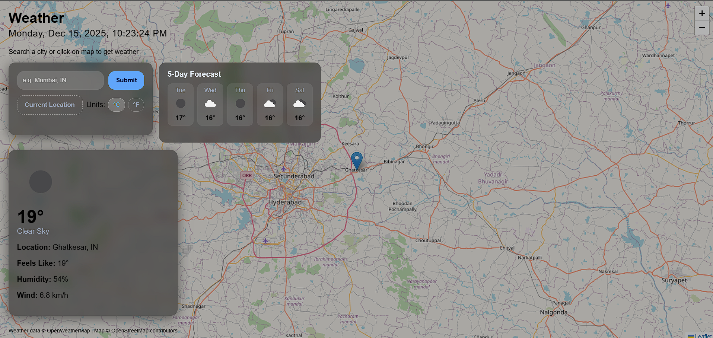

<h1 align="center">🌦️ Weatherly | Map-Based Weather App</h1>

<p align="center"> 
   
   
   
  
</p> 

<p align="center"> 
  <b>Weatherly</b> is a modern, interactive, and fully responsive <b>Map-Based Weather Application</b> 
  built using <b>HTML, CSS, and JavaScript</b>.  
  The app allows users to <b>search weather by city, click directly on a map, or use their current location</b> 
  to view real-time weather data and a multi-day forecast.
</p>

---

## 🚀 Live Demo  
🔗 **View Project:** [🌦️ Weatherly](https://saicharanjanagama.github.io/Weatherly/)

📸 **Preview:**  
<p align="center">
  
</p>

---

## 🎯 Features

- 🔍 Search weather by city name
- 🗺️ Click anywhere on the map to get weather data
- 📍 Get weather using current device location
- 🌡️ Display temperature, feels-like, humidity & wind speed
- 📅 5–6 Day weather forecast
- 🔁 Unit toggle (°C ↔ °F)
- 🕒 Live date & time updates
- 💾 Saves user preferences using LocalStorage
- 📱 Fully responsive for mobile, tablet & desktop
- 🎨 Glassmorphism UI with modern design
- ⚡ Smooth map animations using Leaflet

---

## 🛠️ Technologies Used
- **HTML5**  
  *(Semantic layout, accessible structure)*
  
- **CSS3**  
  *(Grid & Flexbox, Glassmorphism UI, Responsive design, Dark map overlay)*  

- **JavaScript (ES6+)**  
  *(Async/Await, Fetch API, DOM manipulation, Event handling)*  

- **OpenWeatherMap API**  
  *(Current Weather, Forecast, Geocoding & Reverse Geocoding)*  

- **Leaflet.js + OpenStreetMap**  
  *(Interactive map, marker placement, map click weather fetching)*  

- **LocalStorage API**  
  *(Stores unit preference & last viewed location)*  

---

## 🧠 How It Works

1. User enters a city name OR clicks on the map OR uses current location  
2. App converts the location into coordinates  
3. Weather data is fetched using OpenWeatherMap API  
4. UI updates dynamically with weather details & forecast  
5. Preferences (units & last location) are saved automatically 

---

## 📂 Project Structure

Weatherly/<br>
│── index.html<br>
│── css/<br>
│    └── style.css<br>
│── js/<br>
│    ├── app.js # UI & DOM logic<br>
│    ├── api.js # API & map handling<br>
│    └── storage.js # LocalStorage utilities<br>
│── images/<br>
│    └── icons & assets<br>
│── README.md


---

## 🚀 How to View

To view the project locally:  
```bash
open index.html
```

---

## 👨‍💻 Author

It’s me — **Sai Charan Janagama** 😄<br>
🎓 Computer Science Graduate | 🌐 Aspiring Full Stack Developer<br>
📧 [Email Me](saic89738@gmail.com) ↗<br>
🔗 [LinkedIn](https://www.linkedin.com/in/saicharanjanagama/) ↗<br>
💻 [GitHub](https://github.com/SaiCharanJanagama) ↗

---

## 💬 Feedback

If you have any feedback or suggestions, feel free to reach out!  
Your input helps me improve 🚀
